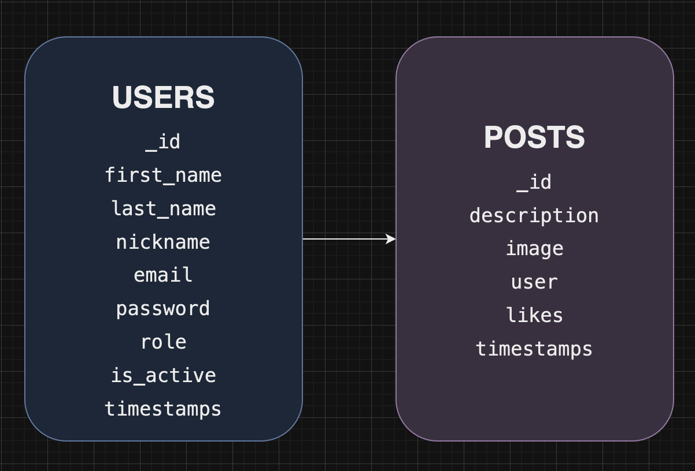

# 🦇 EMME

EMME is a revolutionary social network emerging from the shadows, inspired by the enigmatic and powerful figure of the bat. Much like the iconic Batman, EMME represents the duality between introspection and expression, providing a space where ideas can fly freely and connect people in innovative ways. Our violet color evokes the mystery and creativity of twilight, symbolizing an environment where each user can find their unique voice and share their vision with the world. With EMME, darkness becomes a canvas full of infinite possibilities, where wisdom and imagination come together to illuminate the path towards a more connected future.

## 🌐 Social Network Backend System

This project is designed to develop the backend system for a dynamic social network application.
The system is built to facilitate a smooth user experience while ensuring robust data management and security.

## 🛠️ Features

The social network offers the following features:

**User Authentication:** Users can register and log in to the application. Registration involves creating a new account with email and password, while logging in generates a token for authenticated access.

**User Management:** Authenticated users can view and update their own profiles. Superadmins can view all users, and users can update their profiles with new details such as first name, last name, nickname, email, and password.

**Post Management:** Users can create, update, and delete posts. Each post includes a description and an optional image. Users can view their own posts, all posts, or posts by other users. Additionally, users can like or unlike posts to express their preferences.

**Error Handling:** The system includes comprehensive error handling to manage issues like invalid user credentials, missing required fields, and failed database operations.

## ⚙️ Stack

       

## Local Installation

1. Clone this repository:
`$git clone https://github.com/More-Pe/backend-SocialMedia`
2. Install node modules:
`$ npm install -y`
3. If you don't have one, create a MongoDB container in Docker:
`docker run -d -p 27017:27017 --name mongo -v mongo_data:/data/db -e MONGO_INITDB_ROOT_USERNAME=root -e MONGO_INITDB_ROOT_PASSWORD=root mongo:latest`
4. Connect this repository with our database. Create an `.env` file in the root of the project with the following content, ensuring that these credentials match those set in the MongoDB container:
-`PORT: 4000`
-`MONGO_URI=mongodb://localhost:27017/your_database_name`
-`SALT_ROUNDS=10`
-`JWT_SECRET=example`
5. Elevate our server:
`$ npm run dev`
6. If you want, execute the seeders:
`$ npm run db:seed` or introduce the information manually.

    <a href="https://github.com/More-Pe/frontend-SocialMedia"><strong> Click here to go to de Frontend repo! </strong></a>

## Deploy 🚀

    <a href="https://emme.zeabur.app"><strong> EMME social - Deploy - </strong></a>

## 🗄️ Database Schema

## 🌐 Endpoints

### 🔑 Authentication
| Method | URI                    | Action           | Auth        | Body |
|:--------:|:------------------------:|:------------------:|:-------------:|:------:|
| POST   | /api/auth/register     | Register user    | N/A (public)|`{ "email": "youremail@email.com",` `"password": "yourPassword" }`    |
| POST   | /api/auth/login        | Login user       | N/A (public)|`{ "email": "youremail@email.com",` `"password": "yourPassword" }`      |

### 👥 Users
| Method | URI                     | Action              | Auth                | Body |
|:--------:|:-------------------------:|:---------------------:|:---------------------:|:------:|
| GET    | /api/users              | View all users      | Token (superadmin)  |   N/A   |
| GET    | /api/users/profile      | View user profile   | Token (user)        |   N/A   |
| PUT    | /api/users/profile      | Update user profile | Token (user)        |  `{"first_name": "newFirstName",` `"last_name": "newLastName",` `"user_name": "newUserName",` `"email": "newEmail",` `"password": "newPassword",` `"profilePicture": "newProfilePicture",` `"coverPicture": "newCoverPicture",` `"about": "newAbout"}` |
| GET    | /api/users/followers | Get user followers   | Token (user)         |   N/A   |
| POST   | /api/users/follow/:id    | Follow a user        | Token (user)         |   N/A   |
| POST   | /api/users/unfollow/:id  | Unfollow a user      | Token (user)         |   N/A   |

### 📝 Posts
| Method | URI                        | Action                | Auth        | Body |
|:--------:|:----------------------------:|:-----------------------:|:-------------:|:------:|
| POST   | /api/posts                 | Create post           | Token (user)|`{ "description": "description",` `"image": "URL_image"}`      |
| DELETE | /api/posts/:id             | Delete post           | Token (user)|   N/A   |
| PUT    | /api/posts                 | Update post           | Token (user)|`{ "postId": "postIdToUpdate",` `"description": "newDescription",` `"image": "newURL_image"}`      |
| GET    | /api/posts/own             | Get own posts         | Token (user)|   N/A   |
| GET    | /api/posts                 | Get all posts         | Token (user)|   N/A   |
| GET    | /api/posts/:id             | Get post by id        | Token (user)|   N/A     |
| GET    | /api/posts/users/:user_id  | Get posts by a user   | Token (user)|   N/A     |
| PUT    | /api/posts/like/:id        | Like and unlike post  | Token (user)|   N/A   |

## 📞 Contact

 
